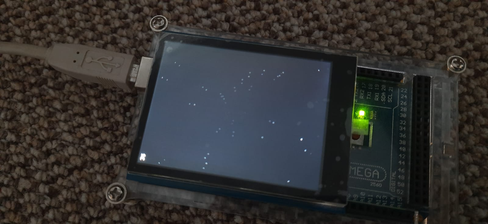

# Stars Screensaver

 

## Parts:
* Arduino MEGA 2560
* A [2.8'' TFT LCD shield w/Cap Touch and microSD](https://www.adafruit.com/product/1947)
(anything that works with ILI9341 should work)

## Setup:
1. Attach the TFT to the top of the arduino
1. Change your settings in settings.h
    * `DEBUG`: if you would like to compile debug `Serial.print`s
    * `TFT_CS`, `TFT_DC` & `TFT_BL`: if you use different ports for your lcd
    * `TFT_BRIGHTNESS`: 0-255 for the backlight strength
    * `STAR_COUNT`: if you would like more or less stars (32 stars gives a nice 41-51fps on my Arduino MEGA 2560)
    * `STAR_MIN_SPEED` & `STAR_MAX_SPEED`: for changing the speed of the stars in pixels per second
    (stars at the center travel at MIN speed
    and stars near the edge of the screen will travel at MAX speed)
    * `SHOW_FPS`: if you would like to see the fps count
    * `FPS_UPDATE_INTERVAL`: how many milliseconds should pass between updating the fps counter
    (to improve performance)
    * `SHOW_MINMAX_FPS`: if you would like to clearly see the min and max fps got
    (only takes effect if `SHOW_FPS` is 1)
1. Upload the sketch
1. See the stars fly by
1. (don't keep it running for too long, since my Arduino starts to get warm)
